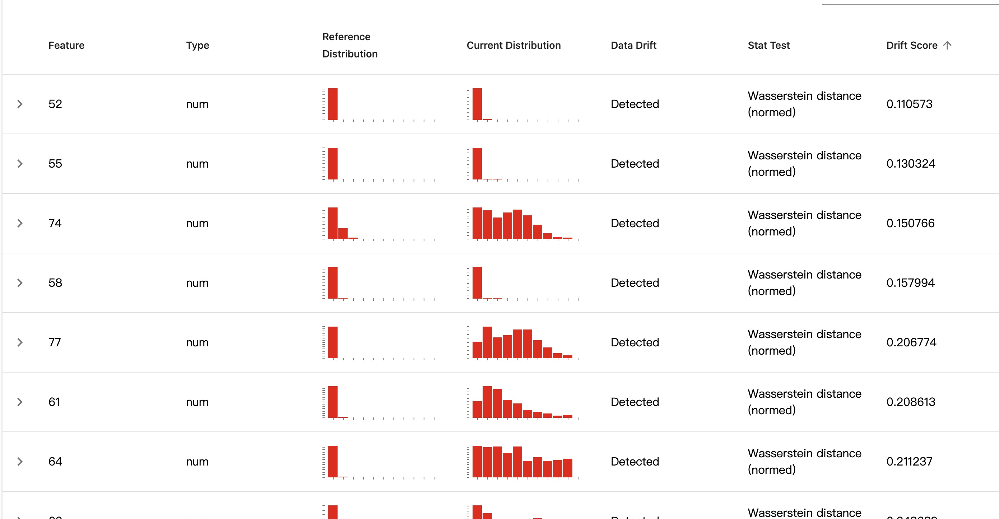

## 数据分布展示
首先做一些数据规约
[decomposition1](../tests/data_vis/test_decomposition1.py)
[decomposition2](../tests/data_vis/test_decomposition.py)

[vis](../tests/test_active_learning/test_modal_vis_csmt.py)

[高维决策边界](../tests/data_vis/test_visualml.py)

## 重要度和敏感度
- [test_sage](../tests/test_Interpretability/sage/test_sage_csmt_arr.py)
- [test_rexplain](../tests/test_Interpretability/rexplain/test_rex_global_csmt_arr.py)
- [test_sensitive](../tests/test_evasion_binary_sensitive.py)

## 主动学习
[alipy_csmt](../tests/test_active_learning/test_alipy_csmt.py) 
[AL_debuging](../tests/test_active_learning/test_alipy_debuging.py) 

[绘制增加点的图](../tests/test_active_learning/test_alipy_debugging_vis_csmt.py)

[Active Learning paper](../../../my_note/my_knowledge_map/AI_engineering/data/active_learning.md)

## 数据分析

[test_evid_1_0](../tests/data_validation/test_evid_1_0.py)
[Evidently](https://github.com/evidentlyai/evidently)

## 使用对抗判断特征敏感度
- [test_sensitive](../tests/test_evasion_binary_sensitive.py)

## 迁移攻击
- [test_transfer](../tests/test_evasion_binary_transfer_ensemble.py)

## 可解释
- [**Deepcheck**](../../../my_note/my_knowledge_map/AI_engineering/data/paper/Deepchecks.md)
  - [**Predictive Power Score (PPS)**](https://8080labs.com/blog/posts/rip-correlation-introducing-the-predictive-power-score-pps/)
  - [PPSgithub](https://github.com/8080labs/ppscore)
  - [test_pps](../tests/test_Interpretability/test_pps.py)
- [test_sage](../tests/test_Interpretability/sage/test_sage_csmt.py)
- [test_rexplain](../tests/test_Interpretability/rexplain/test_rex_global_csmt.py)
- [test_entropy](../tests/test_Interpretability/test_entropy.py)
- [test_skl_fs](../tests/test_Interpretability/test_skl_fs.py)
  - 方差
  - 互信息
  - MIC
- [test_tree_import](../tests/test_Interpretability/test_tree_import.py)
- [test_skl_permu](../tests/test_Interpretability/test_skl_permu.py)
  - [sklearn_important](https://scikit-learn.org/stable/modules/generated/sklearn.inspection.permutation_importance.html)

- [**Interpret ALL**](../tests/test_Interpretability/interpret.md)

## 数据集
[加密流量数据集](../../../my_note/my_knowledge_map/Cyber_security/NIDSs/流量数据集.md)
Tantra: timing-based adversarial network traffic reshaping attack
- Kitsune Dataset
- CICIDS2017

MANDA: On Adversarial Example Detection for Network Intrusion Detection System
- NSL-KDD
- CICIDS2017
- MNIST

Packet-Level Adversarial Network Traffic Crafting using Sequence Generative Adversarial Networks
- KDD99
- CTU13

Generating Practical Adversarial Network Traffic Flows Using NIDSGAN
- NSL-KDD
- CICIDS2017

# 时间序列
[test_sequence](../tests/examples_sequence/test_classifer_sequence.py)