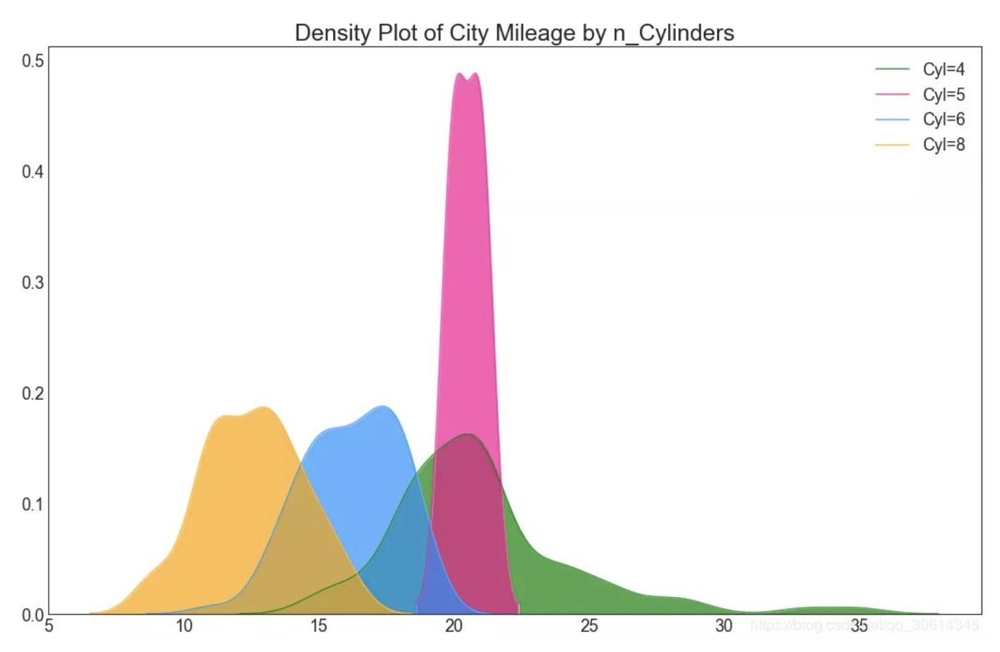

# 数据可视化模块
[数据分布](https://blog.csdn.net/qq_35149632/article/details/104382335)
[test_data_distribution](test_data_distribution.py)
[test_csmt_distribution](test_csmt_distribution.py)


## decision_boundary_grid
```from csmt.figure.visualml.visualml import decision_boundary_grid```

[test_visualml](test_visualml.py)

## decomposition
```from csmt.figure.visualml.plot_ds import plot_ds_2d,plot_ds_3d```
1. 
```
X_tsne_data = np.vstack((X_tsne.T, y)).T 
df_tsne = pd.DataFrame(X_tsne_data, columns=['Dim1', 'Dim2', 'class']) 
df_tsne.head()
plt.figure(figsize=(8, 8)) 
sns.scatterplot(data=df_tsne, hue='class', x='Dim1', y='Dim2') 
plt.show()
```
2. 

[test_decomposition](test_decomposition.py)

## X影响y
```    
fig, axs = plt.subplots(nrows = 3, ncols=5, figsize=(15, 6))
    for i, (ax, col) in enumerate(zip(axs.flat, feature_names)):
        x = X[:,i]
        pf = np.polyfit(x, y, 1)
        p = np.poly1d(pf)
        ax.plot(x, y, 'o')
        ax.plot(x, p(x),"r--")
        ax.set_title(col + ' vs Y')
        ax.set_xlabel(col)
        ax.set_ylabel('Y')
    plt.show()
```

[test_X_vs_y](test_X_vs_y.py)

## Headmap
``` 
def plot_headmap(X,a_score,model_name):
    X_x=X[:,0]
    X_y=X[:,1]
    plt.scatter(X_x, X_y, marker='o', c=a_score, cmap='viridis')
    plt.colorbar()
    plt.xticks(size=14)
    plt.yticks(size=14)
    plt.title(model_name)
    plt.show() 
plot_headmap(X_test,y_pred[0][:,0],orig_models_name)
```  

[test_classifer](../test_classifer.py)

## Decision_regions
``` 
# 目前仅限于异常检测模型
def plot_func(n_classes,models,models_name,table):
    n_classes=np.unique(y_train).size
    fig = CFigure(width=5 * len(models), height=5 * 2)
    for i in range(len(trained_models)):
        fig.subplot(2, int(ceil(len(models) / 2)), i + 1)
        fig.sp.plot_ds(X_test,y_test)
        fig.sp.plot_decision_regions(models[i], n_grid_points=100,n_classes=n_classes)
        fig.sp.plot_fun(models[i].predict_abnormal, plot_levels=False, 
                        multipoint=True, n_grid_points=50,alpha=0.6)
        fig.sp.title(models_name[i])
        fig.sp.text(0.01, 0.01, "Accuracy on test set: {:.2%}".format(table['accuracy'].tolist()[i]))
    fig.show()
plot_func(np.unique(y_train).size,trained_models,orig_models_name,table)
``` 

[test_classifer](../test_classifer.py)

## Attack Path
``` 
# 目前仅限于异常检测模型
def plot_fun_path(n_classes,trained_models,orig_models_name,table,adv_path):
    fig = CFigure(width=5 * len(trained_models), height=5 * 2)

    for i in range(len(trained_models)):
        fig.subplot(2, int(ceil(len(trained_models) / 2)), i + 1)
        fig.sp.plot_ds(X_test,y_test)
        fig.sp.plot_decision_regions(trained_models[i], n_grid_points=100,n_classes=n_classes)
        for j in range(0,10):
            adv_path=X_adv_path[j,:]
            fig.sp.plot_path(adv_path)
    fig.show()
plot_fun_path(np.unique(y_train).size,trained_models,orig_models_name,table,X_adv_path)
``` 

[test_evasion_binary_figure](../test_evasion_binary_figure.py)

## Evidently

[test_evid_1_0](../data_validation/test_evid_1_0.py)
[Evidently](https://github.com/evidentlyai/evidently)


## Anomaly 
``` 
def plot_anomaly(y_test,y_pred):
    y_pred_=y_pred[0][:,1]
    anomaly_scores=y_pred_[y_test==1]
    normal_scores=y_pred_[y_test==0]
    #绘制异常检测异常值图
    plt.figure(figsize=(15, 10))
    plt.hist(normal_scores, bins=100, color='blue')
    plt.hist(anomaly_scores, bins=100, color='orange')
    plt.xlabel('Value', fontsize=14)
    plt.ylabel('Number of Data Points', fontsize=14)
    plt.show()

def plot_anomaly_vec(X_test,y_test,y_pred):
    thres=0
    anomaly_scores_vec=y_pred[0][:,1]
    X_test=X_test[y_test==1]
    anomaly_scores_vec=anomaly_scores_vec[y_test==1]
    # X_test=X_test[y_test==0]
    # anomaly_scores_vec=anomaly_scores_vec[y_test==0]
    plt.figure(figsize=(15, 10))
    plt.scatter(np.linspace(0,len(X_test)-1,len(X_test)),anomaly_scores_vec,s=2,c='orange')
    plt.plot(np.linspace(0,len(X_test)-1,len(X_test)),[thres]*len(X_test),c='black')
    plt.show()
plot_anomaly(y_test,y_pred)
plot_anomaly_vec(X_test,y_test,y_pred)
``` 


[test_classifer_anomaly](../test_classifer_anomaly.py)

## data_vis
[test_vis](test_vis.py)
1. 密度图
```  
plot_density  
```    


2. pairwise
```  
plot_pairwise  
``` 

3. marginal_histogram
```  
plot_marginal_histogram
``` 


4. marginal_boxplot
```  
plot_marginal_boxplot
``` 


## 参考资料
- [论文画图神器！25个常用Matplotlib图的Python代码，收藏收藏！](https://zhuanlan.zhihu.com/p/136854657)
- [50种Matplotlib科研论文绘图合集，含代码实现](https://zhuanlan.zhihu.com/p/220345912)

