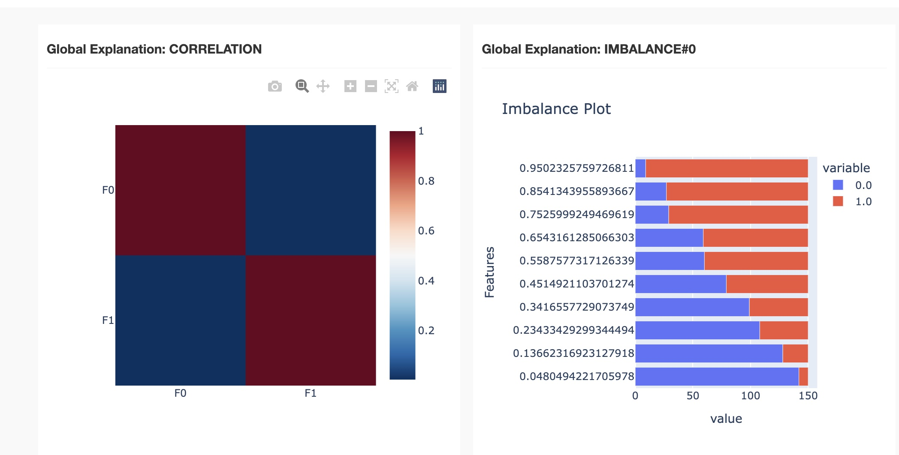
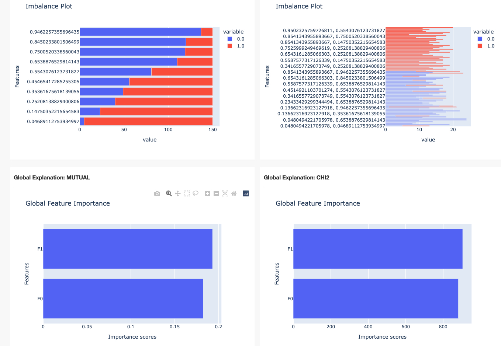
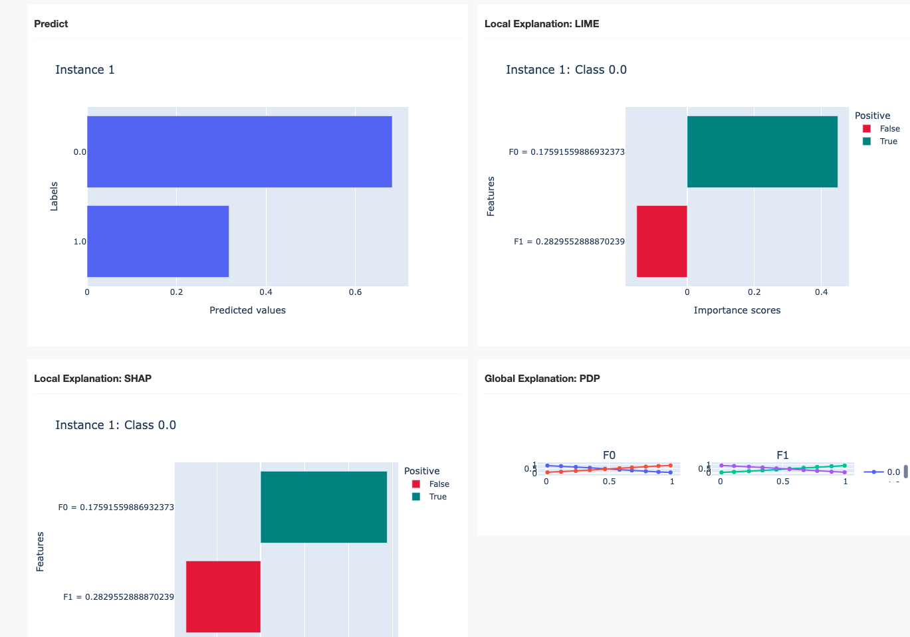
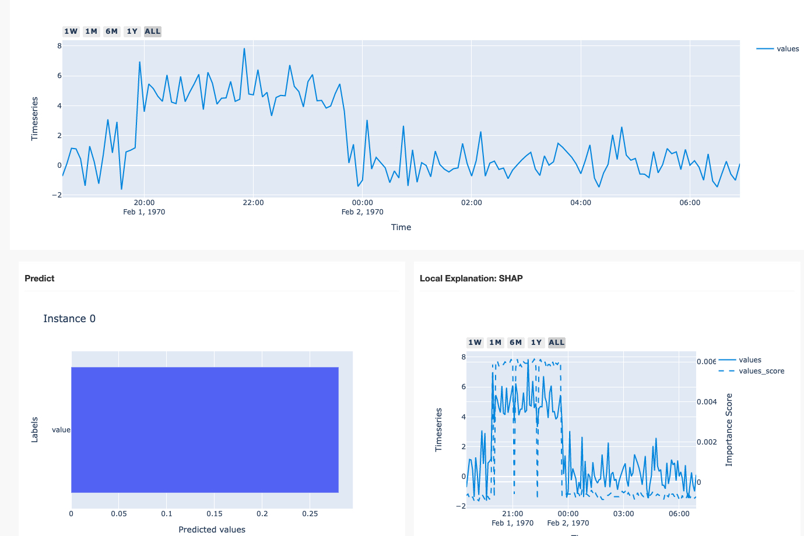

# 可解释

## Sklearn-特征选择
[test_skl_fs](test_skl_fs.py)
[特征选择(Feature Selection)方法汇总](https://zhuanlan.zhihu.com/p/74198735)
pearson（皮尔逊相关系数）r值和P值，两个值都要看，r值表示在样本中变量间的相关系数，表示相关性的大小；
p值是检验值，是检验两变量在样本来自的总体中是否存在和样本一样的相关性。
- 相关系数
  - Pearson
  - Kendall
  - Spearman
- 卡方验证
- 互信息和最大信息系数
- 方差选择法
- 距离相关系数

- mutual_info_regression
估计连续目标变量的互信息
- mutual_info_classif
估计离散目标变量的互信息
- SelectFdr
根据 FPR 测试选择低于 alpha 的 p-values。
FPR 测试代表误报率测试。 它控制总错误检测的数量。
- SelectFdr
选择估计的错误发现率的 p 值
- SelectFwe
选择与 Family-wise error rate 对应的 p 值
- chi2
计算每个非负特征和类之间的卡方统计数据
- SelectPercentile
根据最高分数的百分位选择特征
- SelectKBest
根据k个最高分选择特征
- RFE
具有递归特征消除的特征排名
- RFECV
具有递归特征消除和交叉验证选择最佳特征数量的特征排名
- SequentialFeatureSelector
执行顺序特征选择的转换器（根据模型）

- MIC
[AS-DMF](https://github.com/Timeless-zfqi/AS-DMF-framework)

## 信息墒
[entropy](test_entropy.py)
[ittk: Information Theory Toolkit](https://github.com/MaxwellRebo/ittk)

## 解释库
- [OmniXAI](https://github.com/salesforce/OmniXAI)
  - 敏感度分析
  - 时间序列shap
- [Captum](https://github.com/pytorch/captum)
  - pytorch自带的原生库
- [interpret](https://github.com/interpretml/interpret)
  - DT tree
  - Decision Rules
- [Quantus](https://github.com/understandable-machine-intelligence-lab/Quantus)
  - 解释评估
- [AI Explainability 360](https://github.com/Trusted-AI/AIX360)
  - RuleFit
  - GLRM
- [rexplain](https://github.com/iancovert/removal-explanations)
  - Permutation Test
- [anamod](https://github.com/cloudbopper/anamod)
  - 序列模型解释
  - 树解释
- [SAGE](https://github.com/iancovert/sage/)

## OmniXAI

### 数据分析

[data_analysis](omnixai/data_analysis_csmt.py)

### 分类

[tabular_classification](omnixai/tabular_classification_csmt.py)

### 时间序列

[timeseries](omnixai/timeseries.py)

## SAGE
[sage_line](sage/test_sage_line.py)
[sage_csmt](sage/test_sage_csmt.py)

## Rexplain
<!-- 分类问题 -->
[rex_brca](rexplain/test_rex_brca.py)
<!-- 回归问题 -->
[rex_census](rexplain/test_rex_census.py)
<!-- 局部解释 -->
[local_csmt](rexplain/test_rex_local_csmt.py)
<!-- 全局解释 -->
[global_csmt](rexplain/test_rex_global_csmt.py)

## AI Explainability 360
[aix360-metric](aix360/test_aix360_metrics.py)
- This metric evaluates the correlation between the importance assigned by the interpretability algorithm to attributes and the effect of each of the attributes on the performance of the predictive model.
该指标评估可解释性算法分配给属性的重要性与每个属性对预测模型性能的影响之间的相关性。
- The higher the importance, the higher should be the effect, and vice versa, The metric evaluates this by incrementally removing each of the attributes deemed important by the interpretability metric, and evaluating the effect on the performance, and then calculating the correlation between the weights (importance)of the attributes and corresponding model performance.
重要性越高，效果应该越高，反之亦然，该指标通过逐步删除可解释性指标认为重要的每个属性来评估这一点，并评估对性能的影响，然后计算权重之间的相关性 （重要性）属性和相应的模型性能。
- Returns: correlation between attribute importance weights and corresponding effect on classifier.
返回：属性重要性权重与对分类器的相应影响之间的相关性。

## Quantus
[quantus_orignal](quantus/test_quantus_orignal.py)
[quantus_csmt](quantus/test_quantus_csmt.py)

## Anamod
<!-- 序列模型解释 -->
<!-- 和SAGE进行了对比 -->
[anamod](anamod/test_anamod.py)

